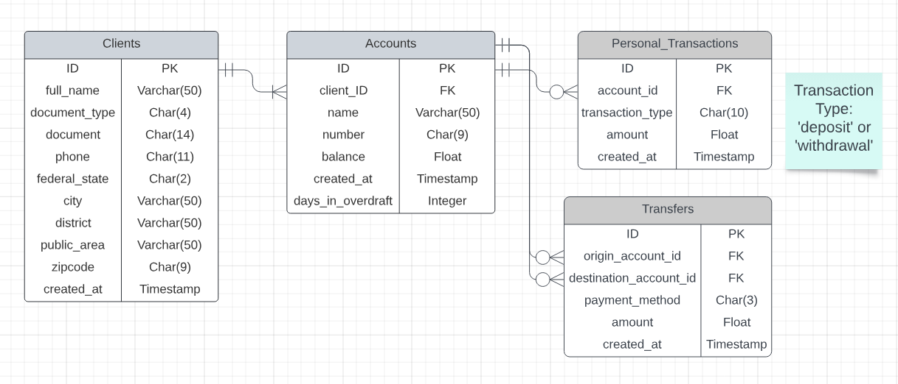

# Console Bank System 
Bank System in Command Line Ruby Application.
Create clients with multiple accounts, make deposits, withdrawals and transfers between accounts and export transaction statements.

The options are selected between numbered menus.

## How to use
After cloning the project, open the project folder and run
- 'bundle install' - to install dependencies
- 'sequel -m db/migrations sqlite://db/bank_system.db' - to run database migrations
- 'ruby seed.rb' - to populate the database with initial accounts
- 'ruby app.rb' - to start the application
## Important notes
- The file 'config.rb' in the folder 'config' contains three boolean constants values that, when set to true, auto-generate some inputs to facilitate the test experience, once the user will not have to worry about filling all fields manually.
- The best experience will be on a full page terminal.

### Daabase Schema

